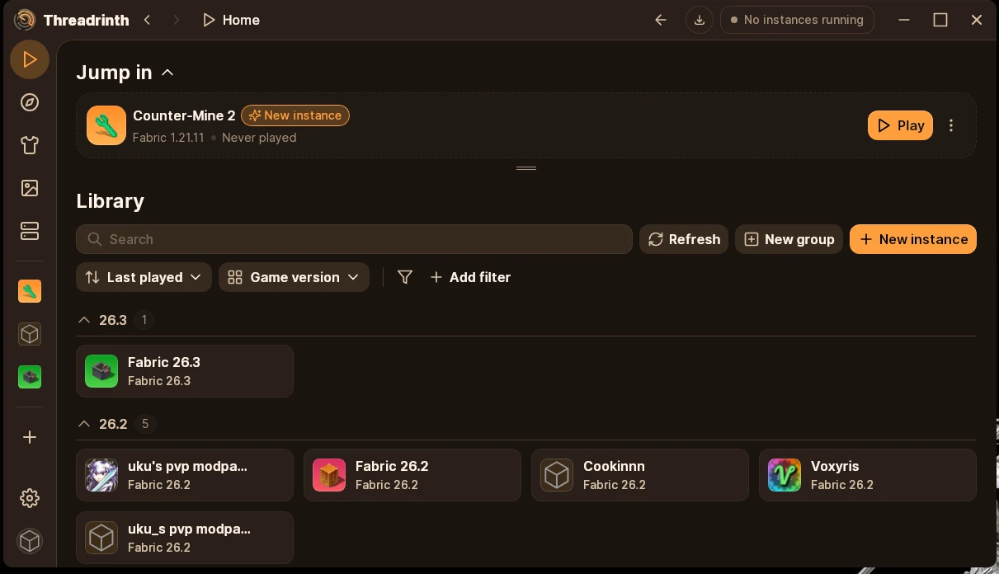
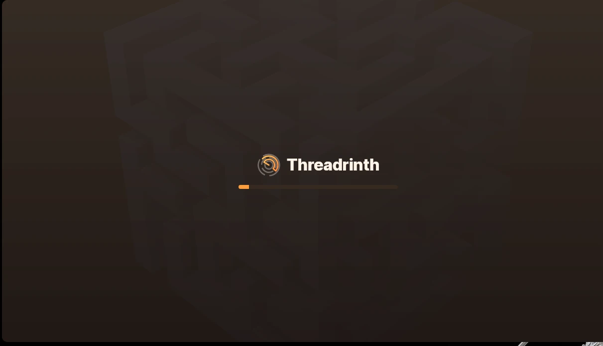

Threadrinth
A Minecraft launcher based on the Modrinth App, with a few extras. It updates to every new Modrinth version automatically.

Not affiliated with or endorsed by Modrinth / Rinth, Inc.

   

What's different
🧩 CurseForge and Feed the Beast
A CurseForge tab right below Discover, kept separate from Modrinth's:

CurseForge mods: search, pick an instance, and the newest file that fits its Minecraft version and mod loader is installed, with its required dependencies.
CurseForge modpacks: installed as new instances, ready to play.
Feed the Beast modpacks: browse and install FTB packs as new instances too.
Mods whose authors don't allow downloads from other apps are listed with a link, so you can grab them by hand.
🖥️ Host any instance as a server
Click Host as server in an instance's menu and you have a server running on your own computer, no folders or start.sh to deal with:

The Minecraft version, mod loader and server-side mods are set up for you. Client-only mods are left out, and Java is downloaded when needed.
Start with a new world (with a seed if you like) or copy one from any instance.
A Host page with a live console (type commands), the player list, CPU and memory use, and settings for port, memory, game mode, difficulty, whitelist, PvP and more.
Play with friends online: your router's automatic port forwarding is tried first; otherwise a free playit.gg address, linked with one click in your browser.
Update the server's mods from the instance in one click after a modpack update.
🎨 Themes and colors
Five extra themes (Ember, Sand, Orchid, Amethyst and Blossom) on top of Modrinth's, plus any accent color you like.

And more
Instance folders just work. Drop an instance folder into the instances folder and click Refresh. It shows up ready to play, like in Prism Launcher.
Brings your Modrinth App instances along with their version, mod loader, icon and playtime.
Works across Windows and Linux, even with one shared instances folder.
Worlds and server packs: copy or move worlds between instances, and export an instance as a ready-to-run server pack.
Skin history: every skin you wear stays on the skins page, even if you change it on minecraft.net.
Updates itself in one click.
Install
Windows (PowerShell):

irm https://raw.githubusercontent.com/Georgwav/Threadrinth/main/scripts/install.ps1 | iex
Linux:

curl -fsSL https://raw.githubusercontent.com/Georgwav/Threadrinth/main/scripts/install.sh | sh
Both download the latest release, check it against its published checksum and install it. Run them again at any time to reinstall. You can also download the installers from the releases page.

Development
cp packages/app-lib/.env.prod packages/app-lib/.env
pnpm install
pnpm app:dev
Needs Node.js, pnpm, Rust and the Tauri prerequisites. The CurseForge tab needs a CurseForge API key in the CURSEFORGE_API_KEY environment variable (at build time, or when running); without one only Feed the Beast works there. main is protected, so open a pull request from a fork.

Code signing policy
Windows releases are built by GitHub Actions from this repository. Only builds of main are signed.

Committers and reviewers: Georgwav
Approvers: Georgwav
Changes to main only land through pull requests.

Privacy: Threadrinth connects to Modrinth (mods and modpacks), Mojang and Microsoft (sign-in, game files, skins) and GitHub (app updates) to work, and to CurseForge, Feed the Beast and playit.gg only when you use those features. Modrinth's anonymous usage statistics are off by default and can be turned on in Settings → Privacy. Threadrinth itself collects nothing.

License
GPL-3.0 like upstream; other packages keep their own licenses (see COPYING.md). Modrinth's branding has been removed. The Threadrinth logo is original artwork.
